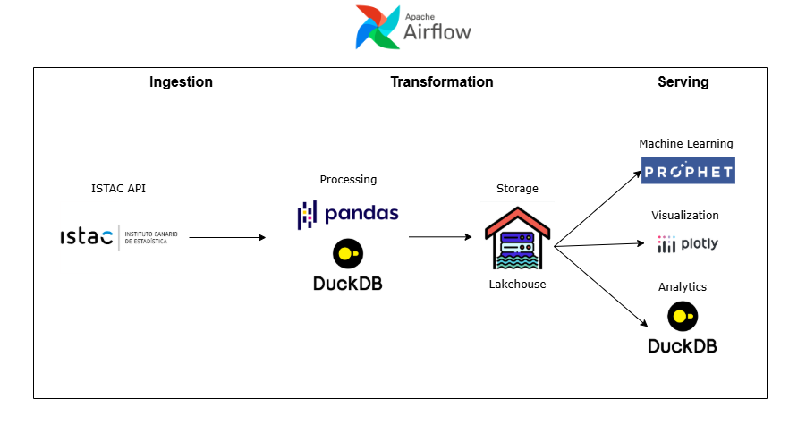

# Automated Data Pipeline for Canary Islands Air Transport Statistics

This project implements an automated data pipeline that collects, processes, and visualizes air transport statistics for the Canary Islands. The pipeline retrieves new data each month, updates visual dashboards, and maintains a clean, structured dataset for analysis. It was built using Apache Airflow, Docker, Python, DuckDB, Prophet and Plotly.

## [Dashboard](https://joseantonio002.github.io/air_transport_statistics_Canary_Islands/)



## [Development blog post](https://joseantonio002.github.io/blog/post-4/)

## Try it yourself

Before starting the platform, make sure the following tools are installed:

- Git
- Docker Engine
- Docker Compose

### 1. Clone the repository

```bash
git clone git@github.com:joseantonio002/air_transport_statistics_Canary_Islands.git
cd air_transport_statistics_Canary_Islands/
```

### 2. Install dependencies

* Use a Python virtual environment (recommended). On Linux:

```bash
python -m venv .venv
source .venv/bin/activate
```

* Install dependencies:

```bash
pip install -r requirements.txt
```

### 3. Initialize the project

Run the initialization script from the project root:

```bash
./src/initialize.sh
```

The script performs the initial project setup:

* creates the dimension tables;
* builds the pipeline Docker image;
* starts Airflow;
* runs the pipeline for the first time.

Once the process finishes, the generated dashboard will be available at:

```text
./docs/index.html
```

During initialization, the script detects the current user ID and the Docker socket group ID. It stores these machine-specific Docker Compose values in:

```text
src/runtime/compose.env
```

Optional Airflow configuration can be defined in:

```text
src/.env
```

### Manage the services

After initialization, pass both environment files when running Docker Compose commands:

```bash
docker compose \
  --env-file src/.env \
  --env-file src/runtime/compose.env \
  -f src/compose.yaml \
  stop
```

Replace `stop` with any of the following commands as needed:

```bash
start
up -d
down
```

For example:

```bash
docker compose \
  --env-file src/.env \
  --env-file src/runtime/compose.env \
  -f src/compose.yaml \
  up -d
```

Running `docker compose down` removes the containers and networks but preserves the PostgreSQL named volume. To delete the volume as well, use:

```bash
docker compose \
  --env-file src/.env \
  --env-file src/runtime/compose.env \
  -f src/compose.yaml \
  down -v
```


# Extra

[Data source](https://www3.gobiernodecanarias.org/istac/statistical-visualizer/visualizer/collection.html?resourceType=collection&agencyId=ISTAC&resourceId=C00017A_000001)

[Airport Data](https://ourairports.com/data/?spm=a2ty_o01.29997173.0.0.59a6c921d0cVCU)

Python version used for the project == 3.12.11


