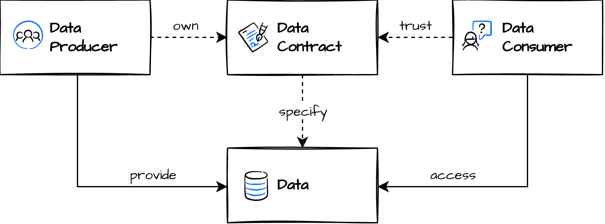

## Note on data contracts

These are not formal data contracts agreed upon by data producers and consumers. They were created solely by me for learning purposes and serve both as configuration files and as documentation for the input and output datasets used in this project.

### James Denmore data contract definition

A data contract is a written agreement between the owner of a source system and the
team ingesting data from that system for use in a data pipeline. The contract should
state what data is being extracted, via what method (full, incremental), how often,
as well as who (person, team) are the contacts for both the source system and the
ingestion. Data contracts should be stored in a well-known and easy-to-find location
such as a GitHub repo or internal documentation site. **If possible, format data contracts
in a standardized form so they can be integrated into the development process or
queried programmatically.**

### Darshil Parmar data contract definition

A formal agreement between a data producer and consumer about the structure, format, and quality of data being exchanged. It's like an API specification but for data pipelines. If the upstream team changes a column type without warning, the contract is broken — and ideally, automated checks catch it before anything goes wrong.

### Chad Sanderson definition

Data Contracts are API-like agreements between Software Engineers who own services and Data Consumers that understand how the business works in order to generate well-modeled, high-quality, trusted, real-time data.

[source 1](https://dataproducts.substack.com/p/the-rise-of-data-contracts)
[source 2](https://dataproducts.substack.com/p/an-engineers-guide-to-data-contracts)

### Entropy data definition

A data contract is a document that defines the ownership, structure, semantics, quality, and terms of use for exchanging data between a data producer and their consumers. Think of an API, but for data.

Ownership – Responsibility for providing correct data
Schema – Column names, data types, structure
Semantics – Descriptions and business meaning
Quality – Validation rules, freshness, completeness
Terms of Use – Usage rights, SLAs, access policies

The [Open Data Contract Standard (ODCS)](https://datacontract.com/) is the open standard for defining data contracts in a machine-readable YAML format.

[source](https://www.entropy-data.com/learn/what-is-a-data-contrac)